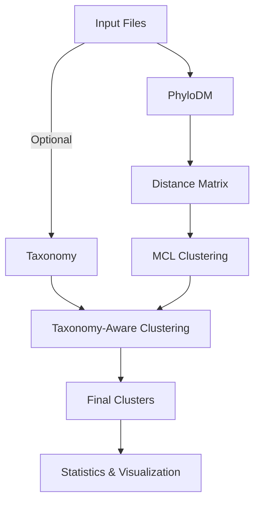

# 🧬 PDMClust: Phylogenetic Distance Matrix Clustering Pipeline

A flexible pipeline for clustering sequences based on phylogenetic distances, with optional taxonomy-based consistency checks.

## 🔍 Overview

PDMClust uses phylogenetic distances to cluster sequences at different thresholds. It can also incorporate taxonomy information to ensure that clusters are consistent at a specified taxonomic level (e.g., genus, family).



## ✨ Features

- 🌳 Clustering based on phylogenetic distances
- 🎚️ Multiple clustering thresholds (0.99, 0.95, 0.9, 0.8, 0.7 by default)
- 🔬 Taxonomy-based consistency checks
- 🔍 Automatic detection of input files
- 📊 Comprehensive output with statistics

## 🛠️ Requirements

- 🐍 Python 3.10+
- 📦 Required Python packages:
  - 🐼 pandas
  - 🔢 numpy
  - 🌲 dendropy
  - 🧬 phylodm
  - 🔄 mcl (Markov Clustering algorithm)

## 📥 Installation

### 📦 Using Pixi (Recommended)

[Pixi](https://pixi.sh) is a package manager that makes it easy to set up isolated environments with all the required dependencies.

```bash
# Install pixi if you don't have it
curl -fsSL https://pixi.sh/install.sh | bash

# Clone the repository
git clone https://github.com/NeLLi-team/pdmclust.git
cd pdmclust

# Install dependencies
pixi install
```

### 🖥️ Using Apptainer/Singularity (Recommended for HPC)

Apptainer (formerly Singularity) is ideal for HPC environments where Docker might not be available.

```bash
# Use the provided build script (handles both Apptainer and Singularity)
./build_container.sh

# Run the Apptainer container with absolute paths inside the container
# but relative paths outside for platform independence
apptainer run \
  --bind $(pwd)/test:/input \
  --bind $(pwd):/output \
  phylodm-clustering.sif \
  --input_dir /input \
  --output_dir /output/test_results

# You can also use relative paths in your command, which will be converted
# to absolute paths inside the container:
apptainer run \
  --bind ./test:/input \
  --bind .:/output \
  phylodm-clustering.sif \
  --input_dir /input \
  --output_dir /output/test_results
```

For older Singularity installations:

```bash
# Use the provided build script
./build_container.sh

# Run with Singularity
singularity run \
  --bind $(pwd)/test:/input \
  --bind $(pwd):/output \
  phylodm-clustering.sif \
  --input_dir /input \
  --output_dir /output/test_results
```

The build script will attempt several build methods in sequence until one succeeds:
1. Build with fakeroot
2. Build with fakeroot and ignore-fakeroot-command
3. Build without fakeroot
4. Build using the sandbox method

This ensures the container can be built in a variety of environments with different security configurations.

### 🛣️ Path Handling

The container uses absolute paths internally for reliable operation, but displays relative paths in the output for platform independence:

- **Inside the container**: All paths are converted to absolute paths to ensure reliable operation
- **In output files**: Paths are displayed as relative paths (just filenames) for platform independence
- **Bind mounts**: Use `--bind` to map your local directories to paths inside the container

This approach ensures that the pipeline works reliably inside the container while maintaining platform independence for the output files.

## 🚀 Usage

### 🔰 Basic Usage with Python

```bash
python phylodm_clustering.py --input_dir test
```

This will:
1. Look for tree, alignment, and taxonomy files in the input directory
2. Perform clustering at thresholds 0.99, 0.95, 0.9, 0.8, 0.7
3. Create a results directory with the clustering results

### 🔰 Basic Usage with Pixi

We've created several predefined tasks in the pixi.toml file for common use cases:

```bash
# Run with test data (no arguments needed)
pixi run run-test

# Run with taxonomy-based clustering on test data
pixi run run-test-with-taxonomy

# Run with custom cutoffs (0.95, 0.9, 0.85) on test data
pixi run run-test-custom-cutoffs-95-90-85

# Run with custom cutoffs (0.99, 0.95, 0.9) on test data
pixi run run-test-custom-cutoffs-99-95-90
```

### 🧪 Advanced Usage

For more advanced usage, you can run the Python script directly with additional parameters:

```bash
python phylodm_clustering.py --input_dir /path/to/input --output_dir /path/to/output --tree /path/to/tree.nwk --alignment /path/to/alignment.faa --taxonomy /path/to/taxonomy.tsv --tax_level 3 --cutoffs 0.99,0.95,0.9,0.85,0.8,0.75,0.7
```

### 🔬 Extracting Cluster Representatives

You can extract cluster representatives (the first sequence from each cluster) at a specific threshold:

```bash
# Extract representatives at threshold 0.7
python phylodm_clustering.py --input_dir test --extract 0.7

# Run clustering and extract representatives in one command
python phylodm_clustering.py --input_dir test --cutoffs 0.99,0.95,0.9,0.8,0.7 --extract 0.7
```

This will create a new FASTA file with the cluster representatives. The output file will be named based on the input alignment file with the threshold appended (e.g., `pimascovirales_faa--GVOG7-fasttree-perc3_07.mafft_t`).

### 🔧 Customizing Pixi Tasks

If you need to add more custom tasks, you can edit the pixi.toml file to add your own tasks:

```toml
# Example of adding a custom task for a specific directory
run-dir-your-directory = "python phylodm_clustering.py --input_dir your_directory"

# Example of adding a custom task with specific parameters
run-custom-task = "python phylodm_clustering.py --input_dir your_directory --cutoffs 0.95,0.9 --tax_level 3"

# Example of adding a custom task for extraction
run-extract-custom = "python phylodm_clustering.py --input_dir your_directory --extract 0.7"
```

## 📁 Input Files

### 🌲 Tree File

A phylogenetic tree in Newick format (*.tree, *.nwk, *.tre, *.treefile, *.contree).

### 🧬 Alignment File

An alignment file in FASTA format (*.aln, *.mafft, *.mafft_t, *.faa, *.fa, *.fasta).

### 🔍 Taxonomy File (Optional)

A tab-separated file with two columns:
1. Sequence ID
2. Taxonomy string in the format "domain|phylum|class|order|family|genus|species"

Example:
```
seq1    Bacteria|Proteobacteria|Gammaproteobacteria|Enterobacterales|Enterobacteriaceae|Escherichia|Escherichia coli
seq2    Bacteria|Firmicutes|Bacilli|Bacillales|Bacillaceae|Bacillus|Bacillus subtilis
```

### 📊 Count File (Optional)

A tab-separated file with the first column containing sequence IDs and subsequent columns containing counts for each sample.

Example:
```
genome_id   sample1 sample2 sample3
seq1        10      5       2
seq2        8       4       1
seq3        6       3       0
```

## 📂 Output Files

The pipeline creates a results directory with the following structure:

```
results_directory/
├── README.md                  # Summary of the results
├── combined_stats.tsv         # Combined statistics for all thresholds
├── clusters/                  # Final clusters for each threshold
│   ├── threshold_0.99.txt
│   ├── threshold_0.95.txt
│   ├── threshold_0.90.txt
│   ├── threshold_0.80.txt
│   └── threshold_0.70.txt
└── phylodm_out/               # Raw PhyloDM output files
    ├── threshold_0.99_0.99.3c
    ├── threshold_0.99_0.99.3c.mcl
    ├── threshold_0.95_0.95.3c
    └── ...
```

## 🔬 Taxonomy Levels

When using taxonomy-based clustering, you can specify the taxonomic level at which to enforce consistency:

- 🧫 Level 1: Species
- 🦠 Level 2: Genus (default)
- 👪 Level 3: Family
- 🏛️ Level 4: Order
- 🏫 Level 5: Class
- 🌍 Level 6: Phylum
- 🌌 Level 7: Domain

## 📊 Example Results

Here are the clustering statistics for the test dataset at different thresholds:

| Threshold | Number of Clusters | Number of Singletons | Average Cluster Size | Largest Cluster Size |
|:---------:|:-----------------:|:-------------------:|:-------------------:|:-------------------:|
| 0.99      | 179               | 178                 | 1.01                | 2                   |
| 0.95      | 174               | 168                 | 1.03                | 2                   |
| 0.90      | 171               | 162                 | 1.05                | 2                   |
| 0.80      | 161               | 146                 | 1.12                | 4                   |
| 0.70      | 153               | 133                 | 1.18                | 4                   |

As expected, lowering the threshold results in fewer clusters and more sequences per cluster.

## 📜 License

This project is licensed under the MIT License.

## 👥 Contributors

- NeLLi Team

## 📞 Contact

For questions or support, please open an issue on GitHub.
